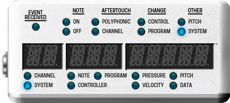

# midi-display.lv2

Device based on [LV2](http://lv2plug.in/) to display MIDI events as a [Mod Device](moddevices.com) widget.



# Build

To build the plugin:

```
make build
```
# Install

To install it to the user space: `~/.lv2/`

```
make install-user
```

To install it to your system: `/lib/lv2`

```
make install
```

# Deploy

Deploy the plugin to the Mod Duo X. It uses the default IP and it's web service.

```
make deploy
```
